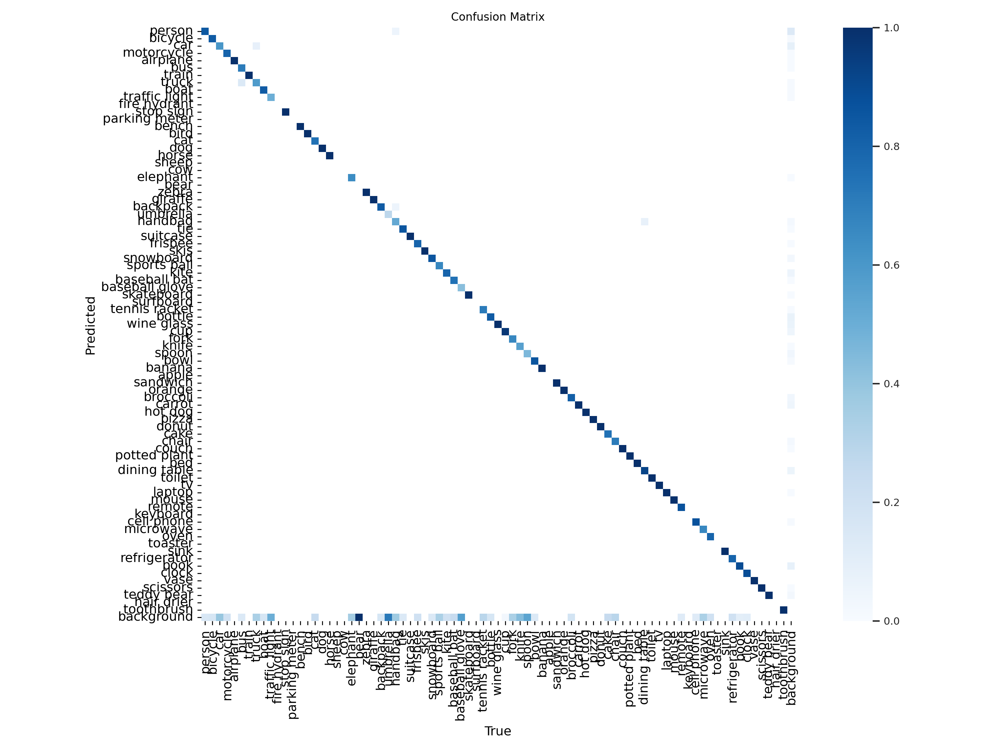
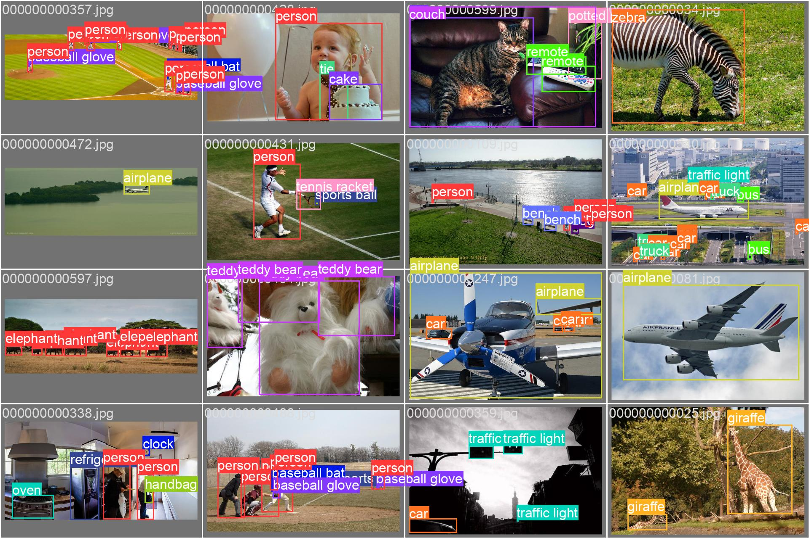
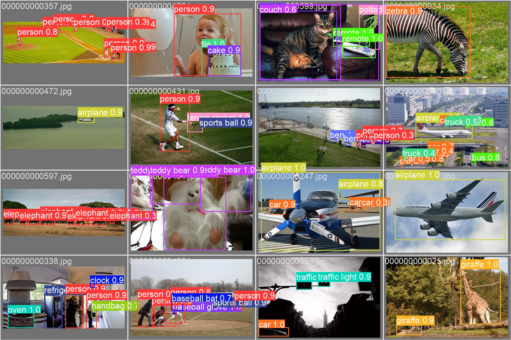
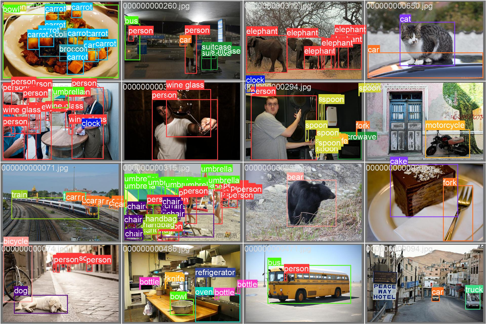
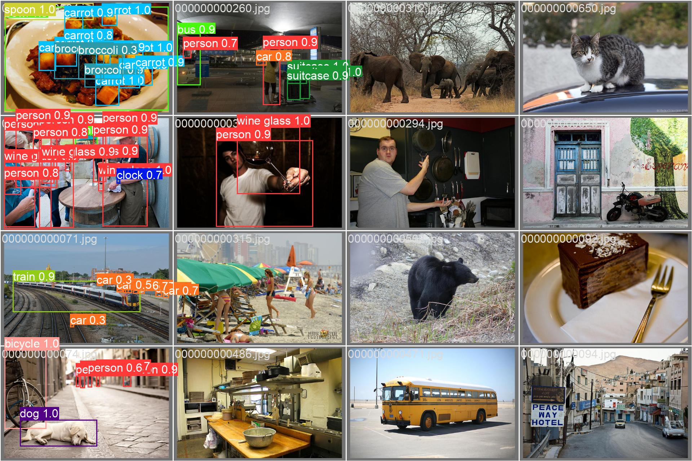
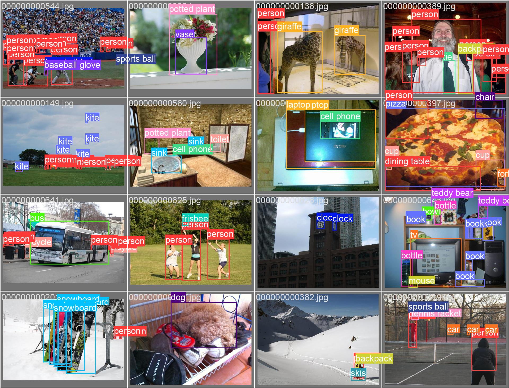
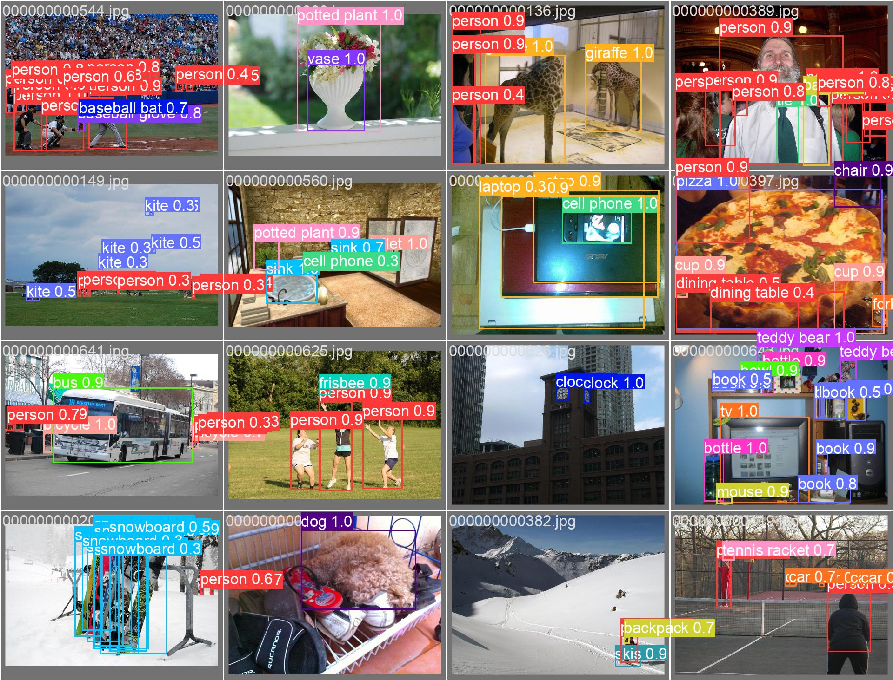

# TinyML Project

Author: Huang ZX黄正翔, Zhao KW赵可为,Guo JP郭锦沛, Wang JH王嘉华, Zhang YZ张耀之

## Introduction
This is the repository for the TinyML course project. Due to time limit, this repository isn't clean and bug-free. However, we implement PTQ algorithm on YOLOv8n and design the SiLU2ReLU transfer learning on it. Besides, we implement a brand new pipeline in the original YOLOv8n framework to enable the state-of-the-art QAS and sparse update algorithm on YOLOv8n. This repository witnessed our great efforts on this work, and will be ready for bug-free testing in the future, but for now, it's sufficient for a course project.

## coco128 results

<table>
  <tr>
    <td>
      
    </td>
    <td>
      
    </td>
  </tr>
  <tr>
    <td>
      
    </td>
    <td>
      
    </td>
  </tr>
  <tr>
    <td>
      
    </td>
    <td>
      
    </td>
  </tr>
</table>

## More: To be continue
